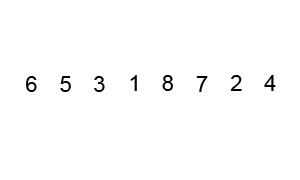

[From medium](https://medium.com/@george.seif94/a-tour-of-the-top-5-sorting-algorithms-with-python-code-43ea9aa02889)

# Sorting overview 
Sorting is a skill that every software engineer and developer needs some knowledge of. Not only to pass coding interviews but as a general understanding of programming itself. The different sorting algorithms are a perfect showcase of how algorithm design can have such a strong effect on program complexity, speed, and efficiency.
Let’s take a tour of the top 6 sorting algorithms and see how we can implement them in Python!

---

### Algorithm comparison

 

### Bubble sort


- Bubble sort is the one usually taught in introductory CS classes since it clearly demonstrates how sort works while being simple and easy to understand.
    - Bubble sort steps through the list and compares adjacent pairs of elements.
    - The elements are swapped if they are in the wrong order. 
    - The pass through the unsorted portion of the list is repeated until the list is sorted.
    - Because Bubble sort repeatedly passes through the unsorted part of the list, it has a worst case complexity of O(n²).
```python
def bubble_sort(arr):
    def swap(i, j):
        arr[i], arr[j] = arr[j], arr[i]

    n = len(arr)
    swapped = True
    
    x = -1
    while swapped:
        swapped = False
        x = x + 1
        for i in range(1, n-x):
            if arr[i - 1] > arr[i]:
                swap(i - 1, i)
                swapped = True
                    
    return arr
```


---

### Selection sort


- Selection sort is also quite simple but frequently outperforms bubble sort. 
- If you are choosing between the two, it’s best to just default right to selection sort. 
    - With Selection sort, we divide our input list / array into two parts: 
        1. The sublist of items already sorted 
        2. The sublist of items remaining to be sorted that make up the rest of the list.
    - We first find the smallest element in the unsorted sublist and place it at the end of the sorted sublist.
    - Thus, we are continuously grabbing the smallest unsorted element and placing it in sorted order in the sorted sublist. 
    - This process continues iteratively until the list is fully sorted.

```python
def selection_sort(arr):        
    for i in range(len(arr)):
        minimum = i
        
        for j in range(i + 1, len(arr)):
            # Select the smallest value
            if arr[j] < arr[minimum]:
                minimum = j

        # Place it at the front of the 
        # sorted end of the array
        arr[minimum], arr[i] = arr[i], arr[minimum]
            
    return arr
```

---

#### Insertion sort


- Insertion sort is both faster and well-arguably more simplistic than both bubble sort and selection sort. 
- How many people sort their cards when playing a card game
    - On each loop iteration, insertion sort removes one element from the array. 
    - It then finds the location where that element belongs within another sorted array and inserts it there. 
    - It repeats this process until no input elements remain.
```python
def insertion_sort(arr):
    for i in range(len(arr)):
        cursor = arr[i]
        pos = i
        
        while pos > 0 and arr[pos - 1] > cursor:
            # Swap the number down the list
            arr[pos] = arr[pos - 1]
            pos = pos - 1
        # Break and do the final swap
        arr[pos] = cursor

    return arr
```

---

#### Merge sort

- Merge sort is a perfectly elegant example of a Divide and Conquer algorithm. 
- It simple uses the 2 main steps of such an algorithm:
    1. Continuously divide the unsorted list until you have N sublists, 
       -  where each sublist has 1 element that is “unsorted” and N is the number of elements in the original array.
    2. Repeatedly merge 
        - i.e conquer the sublists together 2 at a time to produce new sorted sublists until all elements have been fully merged into a single sorted array.

```python
def merge_sort(arr):
    # The last array split
    if len(arr) <= 1:
        return arr
    mid = len(arr) // 2
    # Perform merge_sort recursively on both halves
    left, right = merge_sort(arr[:mid]), merge_sort(arr[mid:])

    # Merge each side together
    return merge(left, right, arr.copy())

def merge(left, right, merged):

    left_cursor, right_cursor = 0, 0
    while left_cursor < len(left) and right_cursor < len(right):
      
        # Sort each one and place into the result
        if left[left_cursor] <= right[right_cursor]:
            merged[left_cursor+right_cursor]=left[left_cursor]
            left_cursor += 1
        else:
            merged[left_cursor + right_cursor] = right[right_cursor]
            right_cursor += 1
            
    for left_cursor in range(left_cursor, len(left)):
        merged[left_cursor + right_cursor] = left[left_cursor]
        
    for right_cursor in range(right_cursor, len(right)):
        merged[left_cursor + right_cursor] = right[right_cursor]

    return merged
```
---

#### Quick sort


- Quick sort is also a divide and conquer algorithm like merge sort. 
- Although it’s a bit more complicated, in most standard implementations it performs significantly faster than merge sort and rarely reaches its worst case complexity of O(n²). 
- It has 3 main steps:
    1. We first select an element which we will call the pivot from the array.
    2. Move all elements that are smaller than the pivot to the left of the pivot; move all elements that are larger than the pivot to the right of the pivot. This is called the partition operation.
    3. Recursively apply the above 2 steps separately to each of the sub-arrays of elements with smaller and bigger values than the last pivot.

```python
def partition(array, begin, end):
    pivot_idx = begin
    for i in range(begin+1, end+1):
        if array[i] <= array[begin]:
            pivot_idx += 1
            array[i], array[pivot_idx] = array[pivot_idx], array[i]
    array[pivot_idx], array[begin] = array[begin], array[pivot_idx]
    return pivot_idx

def quick_sort_recursion(array, begin, end):
    if begin >= end:
        return
    pivot_idx = partition(array, begin, end)
    quick_sort_recursion(array, begin, pivot_idx-1)
    quick_sort_recursion(array, pivot_idx+1, end)

def quick_sort(array, begin=0, end=None):
    if end is None:
        end = len(array) - 1
    
    return quick_sort_recursion(array, begin, end)
```

---

#### Heap Sort
- This popular sorting algorithm, like the Insertion and Selection sorts, segments the list into sorted and unsorted parts.
- It converts the unsorted segment of the list to a Heap data structure, so that we can efficiently determine the largest element.
    - We begin by transforming the list into a Max Heap - a Binary Tree where the biggest element is the root node.
    - We then place that item to the end of the list. 
    - We then rebuild our Max Heap which now has one less value, placing the new largest value before the last item of the list.
    - We iterate this process of building the heap until all nodes are removed.

```python
def heapify(nums, heap_size, root_index):
    # Assume the index of the largest element is the root index
    largest = root_index
    left_child = (2 * root_index) + 1
    right_child = (2 * root_index) + 2

    # If the left child of the root is a valid index, and the element is greater
    # than the current largest element, then update the largest element
    if left_child < heap_size and nums[left_child] > nums[largest]:
        largest = left_child

    # Do the same for the right child of the root
    if right_child < heap_size and nums[right_child] > nums[largest]:
        largest = right_child

    # If the largest element is no longer the root element, swap them
    if largest != root_index:
        nums[root_index], nums[largest] = nums[largest], nums[root_index]
        # Heapify the new root element to ensure it's the largest
        heapify(nums, heap_size, largest)


def heap_sort(nums):
    n = len(nums)

    # Create a Max Heap from the list
    # The 2nd argument of range means we stop at the element before -1 i.e.
    # the first element of the list.
    # The 3rd argument of range means we iterate backwards, reducing the count
    # of i by 1
    for i in range(n, -1, -1):
        heapify(nums, n, i)

    # Move the root of the max heap to the end of
    for i in range(n - 1, 0, -1):
        nums[i], nums[0] = nums[0], nums[i]
        heapify(nums, i, 0)


# Verify it works
random_list_of_nums = [35, 12, 43, 8, 51]
heap_sort(random_list_of_nums)
print(random_list_of_nums)
```

----


#### Shell sort
1. Create a generator gaps that takes the size of the list as argument and returns the next element in the sequence of gaps on each successive call. Here the gap sequence chosen is given by 2^k – 1.
2. Create a function shell_sort that takes a list as argument.
3. For each gap returned by gaps, call insertion_sort_with_gap with gap as argument.
4. Create a function insertion_sort_with_gap that takes a variable gap as argument.
5. The function insertion_sort_with_gap performs insertion sort on all elements at a distance of gap from each other. Thus it performs insertion sort on the indexes k, k + gap, k + 2*gap, k + 3*gap, … of the list for all values of k.

```python
def gaps(size):
    # uses the gap sequence 2^k - 1: 1, 3, 7, 15, 31, ...
    length = size.bit_length()
    for k in range(length - 1, 0, -1):
        yield 2**k - 1
 
 
def shell_sort(alist):
    def insertion_sort_with_gap(gap):
        for i in range(gap, len(alist)):
            temp = alist[i]
            j = i - gap
            while (j >= 0 and temp < alist[j]):
                alist[j + gap] = alist[j]
                j = j - gap
            alist[j + gap] = temp
 
    for g in gaps(len(alist)):
        insertion_sort_with_gap(g)
 
 
alist = input('Enter the list of numbers: ').split()
alist = [int(x) for x in alist]
shell_sort(alist)
print('Sorted list: ', end='')
print(alist)
```
